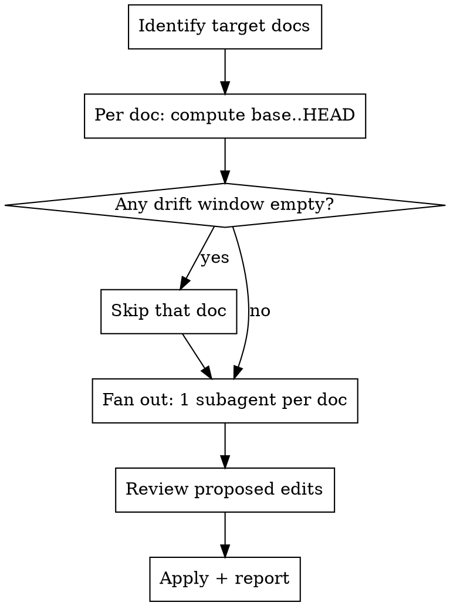

# update-mds

## Overview

Markdown docs (`README.md`, progress/status logs, `CLAUDE.md`) drift behind the code because they're updated by hand and forgotten. This skill brings them current by a precise rule: **for each doc, diff the repo from the last commit that touched THAT doc up to HEAD, then update only that doc from those changes.** Each doc has its own staleness window — `CLAUDE.md` might be 2 commits behind while `README.md` is 40 — so never use a single shared "since" point.

For efficiency, each doc is independent work → **dispatch one subagent per doc, in parallel.** The main agent only coordinates and applies/reviews.

**REQUIRED BACKGROUND:** Use superpowers:dispatching-parallel-agents for the fan-out mechanics.

## When to Use

- After several commits/PRs merge and the prose docs weren't kept in lockstep
- "Update the README to reflect recent changes", "the progress md is stale", "sync CLAUDE.md"
- Before a release, to true-up all docs at once

**When NOT to use:** a single doc you're already editing in this session (just edit it); generating brand-new docs from scratch (there's no "last touched" baseline to diff against).

## Targeting (`$ARGUMENTS`)

By default this skill updates the whole knowledge-doc set. An argument scopes it to one doc type or a single file. Read `$ARGUMENTS` (the text after the skill name, e.g. `/docs-toolkit:update-mds readme`) and pick the target set:

| `$ARGUMENTS` | Target set |
|--------------|-----------|
| *(empty)* | **All** — `README.md` + every `*PROGRESS*`/`*STATUS*`/roadmap doc + every `CLAUDE.md` (root + nested) |
| `readme` / `readmes` / `readme.md` | Every `README.md` (root first, then nested) |
| `claude` / `claude.md` | Every `CLAUDE.md` (root + nested) |
| `progress` / `status` / `roadmap` | Progress/status/roadmap docs (`*PROGRESS*.md`, `*STATUS*.md`, roadmap files) |
| a path or glob (contains `/`, e.g. `docs/PARITY.md`) | Exactly that file (or files matching the glob) |
| multiple tokens (`readme claude`) | Union of those sets |

Precedence: a bare type keyword (`readme`/`claude`/`progress`, with or without a `.md` suffix) maps to its row above — it does NOT fall through to the path branch. The path/glob branch applies only to a token containing `/` or a non-type filename. Match case-insensitively and tolerate plurals. If `$ARGUMENTS` is a path that doesn't resolve under the repo, say so and stop rather than guessing. Everything else (per-file baselines, dirty-check, fan-out, summary) is unchanged — you're only narrowing the candidate list in Workflow step 1. The final summary still lists exactly the docs in the chosen set.

## The Core Rule (per-file baseline)

The whole skill hinges on this. For each target doc:

```bash
# 0. FIRST: is the doc already edited but uncommitted? (critical — see below)
git status --porcelain -- "<doc>"              # non-empty => dirty working tree

# 1. Last commit that modified THIS doc (its personal baseline)
base=$(git log -1 --format=%H -- "<doc>")

# 2. What changed in the repo since then (this is the doc's drift window)
git log --oneline "$base"..HEAD
git diff "$base"..HEAD -- . ':(exclude)*.md'   # code changes, mds excluded as noise
```

`base..HEAD` is different for every doc. Compute it separately each time.

**CRITICAL — uncommitted docs break the baseline.** `git log -1 -- <doc>` reports the last *commit*, which is BEFORE any uncommitted edits sitting in the working tree. If `git status --porcelain -- <doc>` is non-empty, the on-disk file may already contain the very updates you're about to derive — re-applying them duplicates or clobbers real work. So:

- If the doc is **dirty**: read the working-tree file, run `git diff HEAD -- <doc>` to see what's already been written, and treat the on-disk content as the source of truth. Only propose what's *still* missing. If it already covers the drift window, report **"already updated (uncommitted)"** and stop — do not re-derive.
- If the doc is **clean**: use `base..HEAD` as written.

(Don't trust a session's "git status: clean" snapshot — it goes stale mid-session. Re-run `git status` yourself.)

## Workflow



1. **Identify target docs.** Apply **Targeting (`$ARGUMENTS`)** first — with no argument, use the full default set (`README.md`, every `*PROGRESS*.md` / `*STATUS*.md` / roadmap doc, and every `CLAUDE.md` root + nested); with an argument, narrow to just that doc type or file. Find candidates with `git ls-files '*.md' 'CLAUDE.md' '**/CLAUDE.md'`, then filter to the targeted set. Confirm the list with the user if it's large or ambiguous.
2. **Check dirty state, then compute each doc's `base..HEAD`** (see Core Rule). Two skip cases — say which and don't spawn an agent:
   - **No commits in the window** (`git log base..HEAD` empty): doc is at HEAD, nothing to do.
   - **Commits exist but the code-only diff is empty** (window is docs-only commits): no code facts changed — usually already synced. Verify, then skip.
   And one short-circuit: if the doc is **dirty and already covers the window** (Core Rule step 0), report "already updated (uncommitted)" and skip.
3. **Fan out — one subagent per doc, concurrently** (single message, multiple Agent calls). Give each the exact prompt below. **Always pass the ABSOLUTE repo path** — a subagent's default working directory may be a *different* repo than the one you're updating (common when the coordinator runs from another project). Never assume the cwd is the target repo.
4. **Review** each subagent's proposed edits for invented/over-reaching claims, then apply (or let agents apply directly if you trust the scope — for `CLAUDE.md` and READMEs, review first).
5. **Emit the final summary** (see below) — the required closing output.

## Final Summary (required closing output)

After all docs are handled, print one block summarizing the run, one line per doc. State **how many commits of knowledge were folded into each doc**, and **"up to date"** for any that needed nothing. The commit count is the number of distinct in-window commits whose changes actually drove an edit (not the raw window size — show that in parentheses as context).

```
📄 update-mds summary

  README.md         updated — 4 commits of knowledge folded in  (window 18aaf3a..HEAD, 40 commits)
  CLAUDE.md         up to date  (1 commit in window, no code-fact drift)
  PROGRESS.md       up to date — already current in working tree (uncommitted)  (8 commits in window)

  3 docs checked · 1 updated (4 commits) · 2 up to date
```

Rules for the summary:
- **updated — N commits of knowledge folded in** — N = distinct in-window commits that produced an edit. Append the window range + total window size in parens.
- **up to date** — for the skip cases (no commits in window / no code-fact drift / already-updated-uncommitted). Say which reason in parens so it's not mistaken for "unchecked".
- Close with a one-line roll-up: docs checked · docs updated (total commits) · docs up to date.
- Each subagent must return its own commit count so the coordinator can assemble this without re-deriving.

## Subagent Prompt Template

Give each subagent ONE doc. Fill in `<repo>` (ABSOLUTE path), `<doc>` (path relative to `<repo>`), and `<base>`:

```
You are updating a single documentation file to match the code. Do NOT touch any other file.

Repository (absolute path): <repo>
Target doc: <doc>   (relative to <repo>)
Its baseline commit (last time it was edited): <base>

Step 0 — ANCHOR TO THE REPO (do this before anything else):
- `cd <repo>` and confirm: `git rev-parse --show-toplevel` must equal <repo>.
- Verify the baseline exists HERE: `git -C <repo> cat-file -e <base>` must succeed.
- If the toplevel is not <repo>, or <base> is unknown to this repo, or <doc>
  does not exist under <repo>: STOP. Edit nothing. Report "wrong repo /
  baseline not found — refusing to edit." Do NOT fall back to the current
  working directory or any other repo. This guard is mandatory: your default
  cwd may be a DIFFERENT repo than <repo>, and a missing baseline is the
  symptom of being in the wrong one.
- From here on, prefix every git command with `-C <repo>` (or stay cd'd in),
  and Edit only the absolute path <repo>/<doc>.

Steps:
1. Run: git -C <repo> status --porcelain -- <doc>
   If non-empty, the doc has UNCOMMITTED edits. Run: git -C <repo> diff HEAD -- <doc>
   Read what's already written and treat the on-disk file as truth. If it
   already reflects the code changes below, make NO edit and report
   "already updated (uncommitted)". Otherwise only add what's still missing.
2. Read <repo>/<doc> in full.
3. Run: git -C <repo> log --oneline <base>..HEAD
   Run: git -C <repo> diff <base>..HEAD -- . ':(exclude)*.md'
4. Identify only the changes that make <doc> factually wrong or incomplete:
   commands, file paths, schema, routes, behavior, env vars, counts/status.
5. Edit <repo>/<doc> with targeted edits that fix exactly those. Match the
   existing tone, structure, heading style, and section conventions of the file.

Hard rules:
- Document only changes you can see in the diff/log. Never invent features,
  versions, or status. If unsure whether something shipped, leave it.
- Preserve the doc's voice and format. A progress/changelog doc: add an entry,
  flip checkboxes, update summary counts — don't rewrite history. A README:
  update the affected section only. CLAUDE.md: keep its instruction style.
- Do not edit code, tests, or other docs, or any file outside <repo>. Only
  <repo>/<doc>.
- If <base>..HEAD has nothing relevant to <doc>, make no edit and report
  "already current".
- OUT-OF-WINDOW DRIFT: if while reading <doc> you notice a statement that is
  factually wrong against the CURRENT code but whose cause predates <base>
  (so it's outside your window), do NOT silently ignore it. List it under a
  "Pre-baseline drift noticed (not fixed)" heading in your return so the
  coordinator can decide. Fix it only if it's unambiguous and the user asked
  to "bring the doc up to date" broadly.

Return, in this order:
- VERDICT: one of `updated` | `up to date` (with reason) | `already updated (uncommitted)`.
- COMMITS_FOLDED: the count of distinct in-window commits whose changes drove
  an edit (0 if up to date), and the window range + total window commit count.
- A short bullet list of what you changed and why (cite commit hashes).
- Any "pre-baseline drift noticed (not fixed)" notes.
The coordinator uses VERDICT + COMMITS_FOLDED to build the final run summary.
```

## Per-doc-type guidance (pass to the subagent in its prompt)

| Doc type | What to update | What to leave alone |
|----------|----------------|---------------------|
| `README.md` | Setup steps, commands, feature list, structure tree, badges | Marketing prose, license |
| Progress / status / roadmap | Flip `[ ]`→`[x]`, strike closed sections, fix summary counts, add a dated log entry | Past entries (append-only history) |
| `CLAUDE.md` | Architecture notes, file paths, route/schema/middleware facts, command table | Project conventions the user set deliberately |

> **Changelog self-reference:** a progress/changelog doc is usually edited *as part of* the same PR it documents, so its last-commit baseline always trails one unit (one wave/release) behind — and its newest entry is frequently the uncommitted edit you're holding. Lean on the Core Rule's dirty-check here; don't conclude "stale" just because the baseline is old.

## Common Mistakes

- **Editing the wrong repository.** A subagent's default cwd may be a *different* repo than the target. If you pass a baseline commit but not an absolute repo path, the agent can run git against the wrong repo, find the baseline "missing," silently fall back to cwd, and edit the wrong project's docs — with plausible-looking content. Observed live: a CLAUDE.md agent edited the coordinator's repo instead of the target. Fix: pass the ABSOLUTE `<repo>`, `cd`/`git -C <repo>`, verify `git rev-parse --show-toplevel`, and STOP if the baseline isn't in that repo (Subagent Template step 0).
- **Trusting the last-commit baseline on a dirty doc.** `git log -1 -- <doc>` predates uncommitted edits already in the working tree, so you re-derive and clobber work that's done. Always `git status --porcelain -- <doc>` first (Core Rule step 0). Observed live on a progress doc that was already updated but uncommitted.
- **Silently dropping out-of-window errors.** The per-file window correctly scopes *what changed*, but a doc can be wrong for reasons older than its baseline. Don't pretend those don't exist — report them so the user can decide. Strict scoping ≠ "the rest is fine."
- **One shared "since" commit for all docs.** Wrong — each doc has its own last-touched baseline. A README 40 commits stale and a CLAUDE.md 1 commit stale must diff from different points.
- **Including `*.md` in the diff the subagent reads.** Other docs' churn is noise and causes circular "update X to match Y to match X". Exclude markdown from the code diff (`':(exclude)*.md'`).
- **Letting a subagent roam the whole repo.** Scope each to exactly one doc, or they collide and duplicate work.
- **Rewriting append-only history.** Progress/changelog docs accrete entries; add, don't restructure.
- **Inventing status.** "Probably shipped" → leave it. Only document what's in the diff.
- **Serial editing.** Docs are independent; run the agents in parallel, not one after another.

## Quick Reference

```bash
# list candidate docs
git ls-files '*.md' '**/CLAUDE.md'

# per doc:
git status --porcelain -- "$doc"                      # dirty? -> handle uncommitted (Core Rule step 0)
base=$(git log -1 --format=%H -- "$doc")              # its personal baseline
git log --oneline "$base"..HEAD                       # commits since
git diff "$base"..HEAD -- . ':(exclude)*.md'          # code-only diff

# skip case 1: no commits in window
[ -z "$(git log "$base"..HEAD --oneline)" ] && echo "already current (no commits)"
# skip case 2: commits exist but no code changed (docs-only window)
[ -z "$(git diff "$base"..HEAD -- . ':(exclude)*.md')" ] && echo "no code-fact drift"
```
